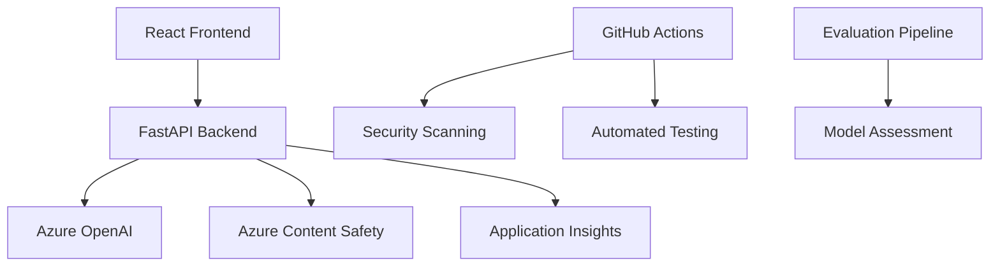

# 🥞 Silver Pancake - AI Meme Generator

> **Enterprise-grade AI meme generator with responsible AI guardrails for team morale and engagement**

[](https://github.com/codess-aus/silver-pancake/actions/workflows/azure-static-web-apps-jolly-wave-0222a6f03.yml)
[](docs/responsible-ai.md)
[](https://jolly-wave-0222a6f03.2.azurestaticapps.net)

Silver Pancake demonstrates how to build engaging AI applications with enterprise-grade safety, security, and responsible AI practices. Users can generate workplace-appropriate memes while sophisticated content moderation ensures professional suitability.

Access it here: https://jolly-wave-0222a6f03.2.azurestaticapps.net

## 🌟 Features

### ✨ AI-Powered Generation
- **Azure OpenAI Integration**: GPT-4 powered meme text generation
- **Multiple Mood Options**: Funny, sarcastic, wholesome, motivational, and relatable
- **Topic Flexibility**: Generate memes about any workplace or general topic

### 🛡️ Enterprise Safety
- **Azure Content Safety**: Real-time content moderation and safety analysis
- **Multi-Layer Protection**: Input validation + generation filters + post-analysis
- **Zero Tolerance**: Automatic blocking of inappropriate, harmful, or biased content

### 📊 Responsible AI
- **Continuous Evaluation**: Automated testing for safety, quality, and bias
- **User Feedback System**: Community-driven content improvement
- **Transparency**: Clear documentation of AI limitations and safety measures
- **Audit Trail**: Comprehensive logging for compliance and improvement

### 🔒 Security & Compliance
- **GitHub Security**: CodeQL analysis, dependency scanning, secret detection
- **Secure APIs**: Encrypted communication with Azure services
- **Privacy First**: No personal data storage, minimal data collection
- **GDPR Ready**: European privacy regulation compliance

## 🏗️ Architecture



### Technology Stack

**Frontend**: React 18, Modern CSS, Responsive Design  
**Backend**: FastAPI, Python 3.11, Async/Await  
**AI Services**: Azure OpenAI (GPT-4), Azure Content Safety  
**Security**: GitHub Advanced Security, CodeQL, Dependabot  
**Monitoring**: Azure Application Insights, Custom Evaluations  
**Deployment**: Azure Static Web Apps, Azure App Service  

## 🚀 Quick Start

### Prerequisites

- Python 3.11+
- Node.js 20+  
- Azure account with OpenAI and Content Safety resources
- Git and GitHub account

### 1. Clone and Setup

```bash
git clone https://github.com/codess-aus/silver-pancake.git
cd silver-pancake
```

### 2. Backend Setup

```bash
cd backend

# Install dependencies
pip install -r requirements.txt

# Configure environment
cp .env.example .env
# Edit .env with your Azure credentials

# Run backend
uvicorn main:app --reload --port 8000
```

### 3. Frontend Setup

```bash
cd frontend

# Install dependencies
npm install

# Start development server
npm start
```

### 4. Access Application

- **Frontend**: http://localhost:3000
- **Backend API**: http://localhost:8000
- **API Docs**: http://localhost:8000/docs

## 📋 Configuration

### Required Environment Variables

Create `backend/.env` with your Azure credentials:

```env
# Azure OpenAI
AZURE_OPENAI_ENDPOINT=https://your-resource.openai.azure.com/
AZURE_OPENAI_API_KEY=your-api-key
AZURE_OPENAI_DEPLOYMENT_NAME=gpt-4

# Azure Content Safety
AZURE_CONTENT_SAFETY_ENDPOINT=https://your-resource.cognitiveservices.azure.com/
AZURE_CONTENT_SAFETY_API_KEY=your-content-safety-key

# Application Settings
ENVIRONMENT=development
CORS_ORIGINS=http://localhost:3000
```

### Azure Resources Setup

1. **Create Azure OpenAI Resource**
   - Deploy GPT-4 model
   - Note endpoint and API key

2. **Create Content Safety Resource**
   - Enable all safety categories
   - Note endpoint and API key

3. **Optional: Application Insights**
   - For monitoring and telemetry
   - Add connection string to config

## 🧪 Testing

### Backend Tests

```bash
cd backend
pytest tests/ -v
```

### Frontend Tests

```bash
cd frontend
npm test
```

### Run Evaluations

```bash
cd evaluations
python run_evaluation.py --type full --verbose
```

## 📊 Responsible AI Evaluation

Silver Pancake includes comprehensive AI evaluation tools:

```bash
# Safety evaluation
python evaluations/run_evaluation.py --type safety

# Quality assessment  
python evaluations/run_evaluation.py --type quality

# Bias detection
python evaluations/run_evaluation.py --type bias

# Full evaluation suite
python evaluations/run_evaluation.py --type full --output results/
```

### Key Metrics

- **Safety Accuracy**: >95% appropriate content detection
- **False Positive Rate**: <5% safe content incorrectly flagged
- **Quality Score**: >85% relevance and appropriateness
- **Bias Detection**: <5% demographic bias indicators

## 🔒 Security Features

### GitHub Security Integration

- **CodeQL Analysis**: Automated security vulnerability scanning
- **Dependency Scanning**: Monitor for vulnerable packages
- **Secret Scanning**: Prevent credential exposure
- **Dependabot**: Automated security updates

### Runtime Security

- **Input Validation**: Sanitize all user inputs
- **API Authentication**: Secure Azure service communication
- **Rate Limiting**: Prevent abuse and excessive usage
- **Audit Logging**: Track all safety and security events

## 🚀 Deployment

### Using Azure Developer CLI (AZD)

```bash
# Initialize AZD (if not already done)
azd init

# Deploy to Azure
azd up
```

### Manual Deployment

1. **Frontend**: Deploy to Azure Static Web Apps
2. **Backend**: Deploy to Azure App Service
3. **Configure**: Set environment variables in Azure
4. **Monitor**: Enable Application Insights

## 📚 Documentation

- [**Responsible AI Guidelines**](docs/responsible-ai.md) - Comprehensive AI ethics and safety practices
- [**Safety Guidelines**](docs/safety-guidelines.md) - Content moderation and safety procedures  
- [**API Documentation**](http://localhost:8000/docs) - Interactive FastAPI documentation
- [**Evaluation Guide**](evaluations/README.md) - AI model assessment procedures

## 🤝 Contributing

We welcome contributions that improve safety, quality, and user experience:

1. **Fork** the repository
2. **Create** a feature branch (`git checkout -b feature/amazing-feature`)
3. **Test** your changes thoroughly
4. **Run** safety evaluations (`python evaluations/run_evaluation.py`)
5. **Commit** with clear messages (`git commit -m 'Add amazing feature'`)
6. **Push** to your branch (`git push origin feature/amazing-feature`)
7. **Open** a Pull Request with detailed description

### Code of Conduct

- Follow responsible AI principles
- Prioritize user safety and inclusivity
- Maintain professional and respectful communication
- Report security issues privately

## 📄 License

This project is licensed under the MIT License - see the [LICENSE](LICENSE) file for details.

## 🆘 Support

### Get Help

- **Documentation**: Comprehensive guides in `/docs`
- **Issues**: Report bugs or request features via GitHub Issues
- **Discussions**: Community Q&A in GitHub Discussions

### Report Safety Issues

- **UI Flag System**: Use "🚩 Flag this meme" for inappropriate content
- **GitHub Issues**: Report systematic safety concerns
- **Emergency Contact**: For critical safety issues requiring immediate attention

## 🎯 Roadmap

### Upcoming Features

- [ ] **Advanced Meme Templates**: Visual meme generation with DALL-E
- [ ] **Multi-language Support**: International workplace humor
- [ ] **Team Collaboration**: Shared meme libraries and voting
- [ ] **Analytics Dashboard**: Usage metrics and safety insights
- [ ] **Integration APIs**: Slack, Teams, and other workplace tools

### Responsible AI Improvements

- [ ] **Enhanced Bias Detection**: More sophisticated fairness analysis
- [ ] **Cultural Adaptation**: Region-specific appropriateness tuning
- [ ] **Accessibility Features**: Screen reader and visual accessibility
- [ ] **User Preference Learning**: Personalized while maintaining safety

---

## 💡 Why Silver Pancake?

Silver Pancake demonstrates that **AI applications can be both engaging and responsible**. By combining:

- **Cutting-edge AI** (Azure OpenAI) with **enterprise safety** (Content Safety)
- **User-friendly interfaces** with **robust security practices**  
- **Creative freedom** with **appropriate guardrails**
- **Fun and engagement** with **professional standards**

This project serves as a template for building AI applications that are safe, ethical, and valuable for real-world enterprise use.

**Built with ❤️ for responsible AI and team morale**

Note: although it is an excellent app architechturally - GenAI Models are not very funny, so as Meme generators go... let's just say, it is better at creating images than jokes.
---

*For the latest updates and announcements, watch this repository and check our [release notes](https://github.com/codess-aus/silver-pancake/releases).*
# Trigger deployment with API URL
